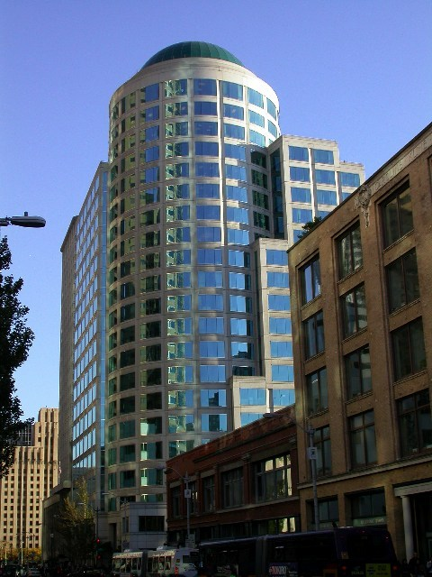
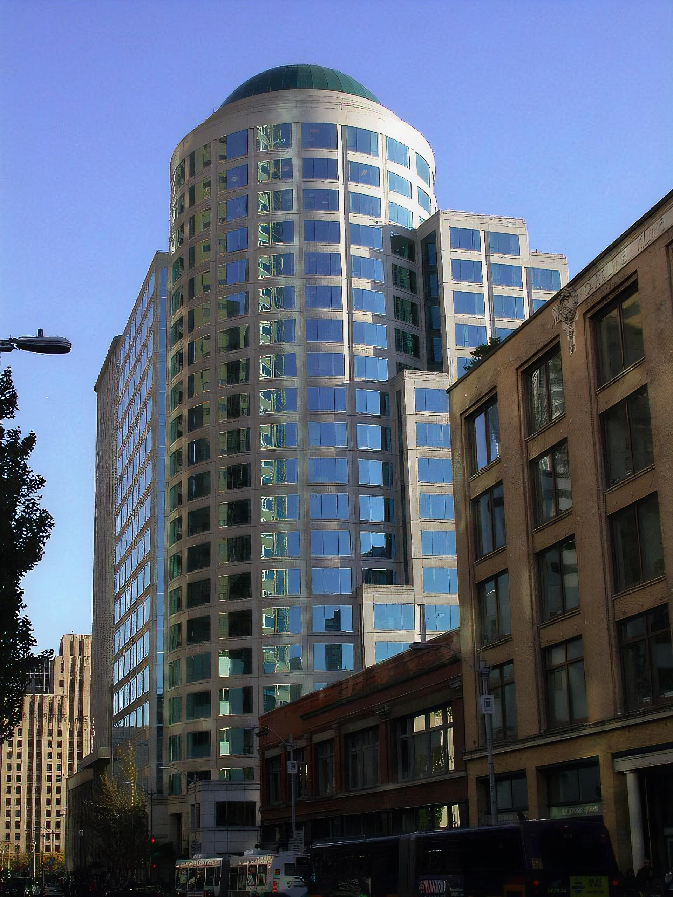

# Image Super-Resolution using SRResNet and SRGAN

A TensorFlow 2 implementation of the paper [Photo-Realistic Single Image Super-Resolution Using a Generative Adversarial
Network](https://arxiv.org/pdf/1609.04802.pdf)

## Examples

Input Image


SRResNet


SRGAN


## Quick Start

### Usage

To run the models, follow the code in: run_model.ipynb.

[](https://colab.research.google.com/github/jlaihong/image-super-resolution/blob/main/run_model.ipynb)

Add images to the examples/input_images directory.

Select between SRResNet or SRGAN

```python
model_name = "srresnet"
```

```python
model_name = "srgan"
```

## Training

Follow the code in: train_SRRestNet_and_SRGAN.ipynb. 

The models train using the [div2k dataset](https://data.vision.ee.ethz.ch/cvl/DIV2K/) using the parameters specified in the paper [Photo-Realistic Single Image Super-Resolution Using a Generative Adversarial
Network](https://arxiv.org/pdf/1609.04802.pdf). I have added a slight adaptation to handle noise from jpeg images when upscaling.

To train without jpeg noise adaptation, change from

```python
train_mappings = [
    lambda lr, hr: random_crop(lr, hr, hr_crop_size=hr_crop_size, scale=dataset_parameters.scale), 
    random_flip, 
    random_rotate, 
    random_lr_jpeg_noise]
```

to

```python
train_mappings = [
    lambda lr, hr: random_crop(lr, hr, hr_crop_size=hr_crop_size, scale=dataset_parameters.scale), 
    random_flip, 
    random_rotate]
```

You can select from the different div2k datasets by changing the key:

```python
dataset_key = "bicubic_x4" # by default
```

**Available keys:** bicubic_x2, unknown_x2, bicubic_x3, unknown_x3, bicubic_x4, unknown_x4, realistic_mild_x4, realistic_difficult_x4, realistic_wild_x4, bicubic_x8

Data will automatically be downloaded and the super resolution scale will be set based on the key.


# Acknowledgements

Example images 000002x4.png, 000003x4.png, 000004x4.png come from [Flickr2K_LR_bicubic X4](https://cv.snu.ac.kr/research/EDSR/Flickr2K.tar)

Example image 187_0019.jpg comes from [Caltech 256](http://www.vision.caltech.edu/Image_Datasets/Caltech256/)

Much of the code in this repository has been refactored from 
https://github.com/krasserm/super-resolution